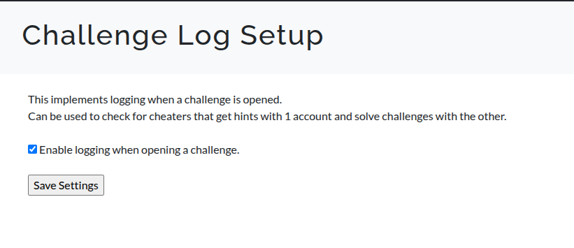
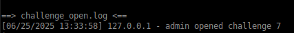

# CTFd-plugin_Challenge-logging

A plugin that creates a log line when a user opens a challenge.   
This can be used to detect cheating, where users register 2 accounts and use 1 account to aqcuire hints.

Included is also a script to parse both logs and calculate the time between opening and solving a challenge.

## Screenshots:

   
  

